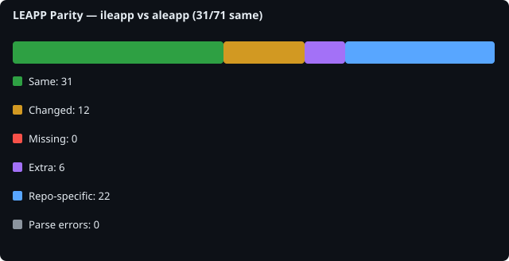

# LEAPP Parity Report

## Scan metadata

- **Generated**: 2026-08-07T05:03:24.492736+00:00
- **Baseline**: `ileapp`
- **Comparison**: `aleapp`

- **ileapp**: `06fb6314ab91` on `main` ([https://github.com/abrignoni/iLEAPP.git](https://github.com/abrignoni/iLEAPP.git))
- **aleapp**: `805e7d424bb5` on `main` ([https://github.com/abrignoni/aLEAPP.git](https://github.com/abrignoni/aLEAPP.git))

## Overall counts

| Metric | Count |
|---|---:|
| Files scanned (union) | 71 |
| Same | 31 |
| Changed (logic/file) | 12 |
| Missing from comparison | 0 |
| Extra in comparison | 6 |
| Expected repo-specific | 22 |
| Parse errors | 0 |
| Import dependency gaps | 3 |

## File-level summary

| Status | Count |
|---|---:|
| same | 31 |
| logic_changed | 12 |
| file_extra_in_comparison | 6 |
| expected_repo_specific | 22 |

## Symbol-level summary

| Status | Count |
|---|---:|
| symbol_missing_from_comparison | 56 |
| symbol_extra_in_comparison | 28 |
| signature_changed | 3 |
| logic_changed | 20 |

## All compared files

71 file(s). See [details/file_list.md](details/file_list.md).

## Import dependency gaps

Baseline files that import modules missing from the comparison repo (for example `ilapfuncs.py` → `context.py`).

3 gap(s). See [details/import_dependency_gaps.md](details/import_dependency_gaps.md).

| Baseline file | Import | Missing in comparison |
|---|---|---|
| `main_entry.py` | `scripts.ios_keychain:report_supplied_keychain` | `scripts/ios_keychain.py` |
| `main_gui.py` | `scripts.tz_offset:tzvalues` | `scripts/tz_offset.py` |
| `scripts/ccl_leveldb.py` | `scripts.ccl_simplesnappy` | `scripts/ccl_simplesnappy.py` |

## Top mismatches

| Logical path | Status | Baseline file | Comparison file |
|---|---|---|---|
| `main_entry.py` | logic_changed | `ileapp.py` | `aleapp.py` | (3 symbol diffs)
| `main_gui.py` | logic_changed | `ileappGUI.py` | `aleappGUI.py` | (7 symbol diffs)
| `scripts/alternate_artifacts/appInventory.py` | logic_changed | `scripts/alternate_artifacts/appInventory.py` | `scripts/alternate_artifacts/appInventory.py` | (17 symbol diffs)
| `scripts/artifact_report.py` | logic_changed | `scripts/artifact_report.py` | `scripts/artifact_report.py` | (12 symbol diffs)
| `scripts/context.py` | logic_changed | `scripts/context.py` | `scripts/context.py` | (7 symbol diffs)
| `scripts/html_parts.py` | logic_changed | `scripts/html_parts.py` | `scripts/html_parts.py` |
| `scripts/ilapfuncs.py` | logic_changed | `scripts/ilapfuncs.py` | `scripts/ilapfuncs.py` | (45 symbol diffs)
| `scripts/lavafuncs.py` | logic_changed | `scripts/lavafuncs.py` | `scripts/lavafuncs.py` | (2 symbol diffs)
| `scripts/modules_to_exclude.py` | logic_changed | `scripts/modules_to_exclude.py` | `scripts/modules_to_exclude.py` |
| `scripts/report.py` | logic_changed | `scripts/report.py` | `scripts/report.py` | (4 symbol diffs)
| `scripts/search_files.py` | logic_changed | `scripts/search_files.py` | `scripts/search_files.py` | (10 symbol diffs)
| `scripts/version_info.py` | logic_changed | `scripts/version_info.py` | `scripts/version_info.py` |
| `leapp_functions/__init__.py` | file_extra_in_comparison | `—` | `leapp_functions/__init__.py` |
| `leapp_functions/app/__init__.py` | file_extra_in_comparison | `—` | `leapp_functions/app/__init__.py` |
| `scripts/ccl/ccl_android_fcm_queued_messages.py` | file_extra_in_comparison | `—` | `scripts/ccl/ccl_android_fcm_queued_messages.py` |
| `scripts/ccl/ccl_leveldb.py` | file_extra_in_comparison | `—` | `scripts/ccl/ccl_leveldb.py` |
| `scripts/ccl/ccl_protobuff.py` | file_extra_in_comparison | `—` | `scripts/ccl/ccl_protobuff.py` |
| `scripts/ccl/ccl_simplesnappy.py` | file_extra_in_comparison | `—` | `scripts/ccl/ccl_simplesnappy.py` |

## Changed logic files

12 file(s). See [details/changed_logic.md](details/changed_logic.md).

Preview

### `main_entry.py`
- module-level logic changed
- logic changed: `main`
- logic changed: `validate_args`
### `main_gui.py`
- module-level logic changed
- logic changed: `ValidateInput`
- logic changed: `case_data`
- only in ileapp: `clear_keychain` — `def clear_keychain()`
- logic changed: `filter_modules`
- logic changed: `pickModules`
- logic changed: `process`
- only in ileapp: `select_keychain` — `def select_keychain()`
### `scripts/alternate_artifacts/appInventory.py`
- module-level logic changed
- only in ileapp: `_build_guid_map` — `def _build_guid_map(seeker)`
- only in ileapp: `_container_type_from_path` — `def _container_type_from_path(path)`
- logic changed: `_format_utc`
- only in ileapp: `_guids_from_device_path` — `def _guids_from_device_path(device_path)`
- logic changed: `_iter_extraction_files`
- only in ileapp: `_map_path_to_app` — `def _map_path_to_app(path, guid_map)`
- only in aleapp: `_map_path_to_package` — `def _map_path_to_package(path)`
- only in ileapp: `_parse_application_state` — `def _parse_application_state(db_path)`
- only in ileapp: `_parse_blob` — `def _parse_blob(appid, blob)`
- only in aleapp: `_parse_packages_xml` — `def _parse_packages_xml(file_path)`
- only in aleapp: `_read_build_prop` — `def _read_build_prop(file_path)`
- only in ileapp: `_read_container_metadata` — `def _read_container_metadata(plist_path)`
- only in aleapp: `_read_unix_time_ms` — `def _read_unix_time_ms(unix_time_ms)`
- logic changed: `_seeker_kind`
- logic changed: `appFileInventory`
- logic changed: `extractionInfo`
- logic changed: `installedAppInventory`
### `scripts/artifact_report.py`
- module-level logic changed
- only in aleapp: `ArtifactHtmlReport.add_chart` — `def add_chart(self, height=...)`
- only in aleapp: `ArtifactHtmlReport.add_chart_script` — `def add_chart_script(self, id, type, data, labels, title, xLabel, yLabel)`
- only in aleapp: `ArtifactHtmlReport.add_chat` — `def add_chat(self)`
- only in aleapp: `ArtifactHtmlReport.add_chat_invisble` — `def add_chat_invisble(self, id, text)`
- only in aleapp: `ArtifactHtmlReport.add_chat_window` — `def add_chat_window(self, head, body)`
- only in aleapp: `ArtifactHtmlReport.add_heat_map` — `def add_heat_map(self, json)`

## Missing files

0 file(s). See [details/missing_files.md](details/missing_files.md).

Preview

_None._

## Extra files

6 file(s). See [details/extra_files.md](details/extra_files.md).

Preview

- `leapp_functions/__init__.py` (comparison: `leapp_functions/__init__.py`)
- `leapp_functions/app/__init__.py` (comparison: `leapp_functions/app/__init__.py`)
- `leapp_functions/parsers/apple_atx.py` _(expected repo-specific)_ (comparison: `None`)
- `scripts/ccl/ccl_android_fcm_queued_messages.py` (comparison: `scripts/ccl/ccl_android_fcm_queued_messages.py`)
- `scripts/ccl/ccl_bplist.py` _(expected repo-specific)_ (comparison: `None`)
- `scripts/ccl/ccl_leveldb.py` (comparison: `scripts/ccl/ccl_leveldb.py`)
- `scripts/ccl/ccl_protobuff.py` (comparison: `scripts/ccl/ccl_protobuff.py`)
- `scripts/ccl/ccl_segb1.py` _(expected repo-specific)_ (comparison: `None`)
- `scripts/ccl/ccl_segb2.py` _(expected repo-specific)_ (comparison: `None`)
- `scripts/ccl/ccl_simplesnappy.py` (comparison: `scripts/ccl/ccl_simplesnappy.py`)
- `scripts/ccl_leveldb.py` _(expected repo-specific)_ (comparison: `None`)
- `scripts/ccl_segb/__init__.py` _(expected repo-specific)_ (comparison: `None`)
- `scripts/ccl_segb/ccl_segb.py` _(expected repo-specific)_ (comparison: `None`)
- `scripts/ccl_segb/ccl_segb1.py` _(expected repo-specific)_ (comparison: `None`)
- `scripts/ccl_segb/ccl_segb2.py` _(expected repo-specific)_ (comparison: `None`)
- `scripts/ccl_segb/ccl_segb_common.py` _(expected repo-specific)_ (comparison: `None`)
- `scripts/ccl_simplesnappy.py` _(expected repo-specific)_ (comparison: `None`)
- `scripts/chat_rendering.py` _(expected repo-specific)_ (comparison: `None`)
- `scripts/geo_utils.py` _(expected repo-specific)_ (comparison: `scripts/geo_utils.py`)
- `scripts/googleKeepNotes.py` _(expected repo-specific)_ (comparison: `scripts/googleKeepNotes.py`)

## Expected repo-specific files

22 file(s).

## Parse errors

0 file(s). See [details/parse_errors.md](details/parse_errors.md).

Preview

_None._

## Signature changes

3 symbol(s). See [details/signature_changes.md](details/signature_changes.md).
