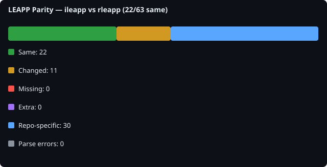

# LEAPP Parity Report

## Scan metadata

- **Generated**: 2026-08-07T05:02:47.949919+00:00
- **Baseline**: `ileapp`
- **Comparison**: `rleapp`

- **ileapp**: `06fb6314ab91` on `main` ([https://github.com/abrignoni/iLEAPP.git](https://github.com/abrignoni/iLEAPP.git))
- **rleapp**: `fc2e36891ad5` on `main` ([https://github.com/abrignoni/RLEAPP.git](https://github.com/abrignoni/RLEAPP.git))

## Overall counts

| Metric | Count |
|---|---:|
| Files scanned (union) | 63 |
| Same | 22 |
| Changed (logic/file) | 11 |
| Missing from comparison | 0 |
| Extra in comparison | 0 |
| Expected repo-specific | 30 |
| Parse errors | 0 |
| Import dependency gaps | 11 |

## File-level summary

| Status | Count |
|---|---:|
| same | 22 |
| logic_changed | 11 |
| expected_repo_specific | 30 |

## Symbol-level summary

| Status | Count |
|---|---:|
| symbol_missing_from_comparison | 28 |
| symbol_extra_in_comparison | 7 |
| signature_changed | 1 |
| logic_changed | 34 |

## All compared files

63 file(s). See [details/file_list.md](details/file_list.md).

## Import dependency gaps

Baseline files that import modules missing from the comparison repo (for example `ilapfuncs.py` → `context.py`).

11 gap(s). See [details/import_dependency_gaps.md](details/import_dependency_gaps.md).

| Baseline file | Import | Missing in comparison |
|---|---|---|
| `main_entry.py` | `scripts.ios_keychain:report_supplied_keychain` | `scripts/ios_keychain.py` |
| `main_gui.py` | `scripts.tz_offset:tzvalues` | `scripts/tz_offset.py` |
| `scripts/blackboxprotobuf/__init__.py` | `scripts.blackboxprotobuf.lib.interface:*` | `scripts/blackboxprotobuf/lib/interface.py` |
| `scripts/blackboxprotobuf/lib/interface.py` | `scripts.blackboxprotobuf.lib.types.length_delim` | `scripts/blackboxprotobuf/lib/types/length_delim.py` |
| `scripts/blackboxprotobuf/lib/interface.py` | `scripts.blackboxprotobuf.lib.types.type_maps` | `scripts/blackboxprotobuf/lib/types/type_maps.py` |
| `scripts/blackboxprotobuf/lib/types/length_delim.py` | `scripts.blackboxprotobuf.lib.types` | `scripts/blackboxprotobuf/lib/types/__init__.py` |
| `scripts/blackboxprotobuf/lib/types/length_delim.py` | `scripts.blackboxprotobuf.lib.types:varint` | `scripts/blackboxprotobuf/lib/types/__init__.py` |
| `scripts/blackboxprotobuf/lib/types/type_maps.py` | `scripts.blackboxprotobuf.lib.types:fixed` | `scripts/blackboxprotobuf/lib/types/__init__.py` |
| `scripts/blackboxprotobuf/lib/types/type_maps.py` | `scripts.blackboxprotobuf.lib.types:length_delim` | `scripts/blackboxprotobuf/lib/types/__init__.py` |
| `scripts/blackboxprotobuf/lib/types/type_maps.py` | `scripts.blackboxprotobuf.lib.types:varint` | `scripts/blackboxprotobuf/lib/types/__init__.py` |
| `scripts/ccl_leveldb.py` | `scripts.ccl_simplesnappy` | `scripts/ccl_simplesnappy.py` |

## Top mismatches

| Logical path | Status | Baseline file | Comparison file |
|---|---|---|---|
| `main_entry.py` | logic_changed | `ileapp.py` | `rleapp.py` | (3 symbol diffs)
| `main_gui.py` | logic_changed | `ileappGUI.py` | `rleappGUI.py` | (5 symbol diffs)
| `scripts/artifact_report.py` | logic_changed | `scripts/artifact_report.py` | `scripts/artifact_report.py` | (1 symbol diffs)
| `scripts/context.py` | logic_changed | `scripts/context.py` | `scripts/context.py` | (8 symbol diffs)
| `scripts/html_parts.py` | logic_changed | `scripts/html_parts.py` | `scripts/html_parts.py` |
| `scripts/ilapfuncs.py` | logic_changed | `scripts/ilapfuncs.py` | `scripts/ilapfuncs.py` | (23 symbol diffs)
| `scripts/lavafuncs.py` | logic_changed | `scripts/lavafuncs.py` | `scripts/lavafuncs.py` | (15 symbol diffs)
| `scripts/modules_to_exclude.py` | logic_changed | `scripts/modules_to_exclude.py` | `scripts/modules_to_exclude.py` |
| `scripts/report.py` | logic_changed | `scripts/report.py` | `scripts/report.py` | (4 symbol diffs)
| `scripts/search_files.py` | logic_changed | `scripts/search_files.py` | `scripts/search_files.py` | (10 symbol diffs)
| `scripts/version_info.py` | logic_changed | `scripts/version_info.py` | `scripts/version_info.py` | (1 symbol diffs)

## Changed logic files

11 file(s). See [details/changed_logic.md](details/changed_logic.md).

Preview

### `main_entry.py`
- module-level logic changed
- logic changed: `main`
- logic changed: `validate_args`
### `main_gui.py`
- module-level logic changed
- logic changed: `ValidateInput`
- only in ileapp: `clear_keychain` — `def clear_keychain()`
- logic changed: `pickModules`
- logic changed: `process`
- only in ileapp: `select_keychain` — `def select_keychain()`
### `scripts/artifact_report.py`
- module-level logic changed
- logic changed: `ArtifactHtmlReport.start_artifact_report`
### `scripts/context.py`
- module-level logic changed
- only in ileapp: `Context.get_apple_os_version` — `@@def get_apple_os_version(build, device_family=...)`
- only in ileapp: `Context.get_installed_os_version` — `@@def get_installed_os_version()`
- only in ileapp: `Context.get_keychain_path` — `@@def get_keychain_path()`
- only in ileapp: `Context.get_metadata` — `@@def get_metadata(collection)`
- logic changed: `Context.get_relative_path`
- only in ileapp: `Context.lookup_metadata` — `@@def lookup_metadata(collection, key, group=...)`
- only in ileapp: `Context.set_installed_os_version` — `@@def set_installed_os_version(os_version)`
- only in ileapp: `Context.set_keychain_path` — `@@def set_keychain_path(keychain_path)`
### `scripts/html_parts.py`
- module-level logic changed
### `scripts/ilapfuncs.py`
- module-level logic changed
- logic changed: `OutputParameters.__init__`
- only in ileapp: `_batched` — `def _batched(iterable, size)`
- only in rleapp: `_count_generator` — `def _count_generator(reader)`
- only in ileapp: `_deserialize_nska` — `def _deserialize_nska(data)`
- only in rleapp: `_get_line_count` — `def _get_line_count(file)`
- logic changed: `artifact_processor`
- only in ileapp: `artifact_processor_streaming` — `def artifact_processor_streaming(func)`
- logic changed: `device_info`
- only in rleapp: `gather_hashes_in_file` — `def gather_hashes_in_file(file_found, regex)`
- logic changed: `generate_hexdump`
- logic changed: `generate_thumbnail`
- logic changed: `get_plist_content`

## Missing files

0 file(s). See [details/missing_files.md](details/missing_files.md).

Preview

_None._

## Extra files

0 file(s). See [details/extra_files.md](details/extra_files.md).

Preview

- `leapp_functions/parsers/apple_atx.py` _(expected repo-specific)_ (comparison: `None`)
- `scripts/alternate_artifacts/appInventory.py` _(expected repo-specific)_ (comparison: `None`)
- `scripts/blackboxprotobuf/__init__.py` _(expected repo-specific)_ (comparison: `None`)
- `scripts/blackboxprotobuf/lib/__init__.py` _(expected repo-specific)_ (comparison: `None`)
- `scripts/blackboxprotobuf/lib/interface.py` _(expected repo-specific)_ (comparison: `None`)
- `scripts/blackboxprotobuf/lib/types/__init__.py` _(expected repo-specific)_ (comparison: `None`)
- `scripts/blackboxprotobuf/lib/types/fixed.py` _(expected repo-specific)_ (comparison: `None`)
- `scripts/blackboxprotobuf/lib/types/length_delim.py` _(expected repo-specific)_ (comparison: `None`)
- `scripts/blackboxprotobuf/lib/types/type_maps.py` _(expected repo-specific)_ (comparison: `None`)
- `scripts/blackboxprotobuf/lib/types/varint.py` _(expected repo-specific)_ (comparison: `None`)
- `scripts/ccl/ccl_bplist.py` _(expected repo-specific)_ (comparison: `None`)
- `scripts/ccl/ccl_segb1.py` _(expected repo-specific)_ (comparison: `None`)
- `scripts/ccl/ccl_segb2.py` _(expected repo-specific)_ (comparison: `None`)
- `scripts/ccl_leveldb.py` _(expected repo-specific)_ (comparison: `None`)
- `scripts/ccl_segb/__init__.py` _(expected repo-specific)_ (comparison: `None`)
- `scripts/ccl_segb/ccl_segb.py` _(expected repo-specific)_ (comparison: `None`)
- `scripts/ccl_segb/ccl_segb1.py` _(expected repo-specific)_ (comparison: `None`)
- `scripts/ccl_segb/ccl_segb2.py` _(expected repo-specific)_ (comparison: `None`)
- `scripts/ccl_segb/ccl_segb_common.py` _(expected repo-specific)_ (comparison: `None`)
- `scripts/ccl_simplesnappy.py` _(expected repo-specific)_ (comparison: `None`)

## Expected repo-specific files

30 file(s).

## Parse errors

0 file(s). See [details/parse_errors.md](details/parse_errors.md).

Preview

_None._

## Signature changes

1 symbol(s). See [details/signature_changes.md](details/signature_changes.md).
