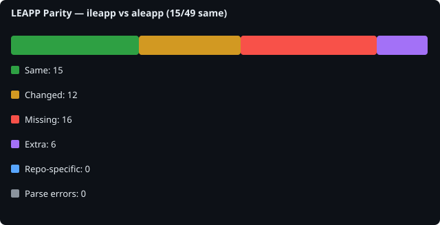

# LEAPP Parity Report

## Scan metadata

- **Generated**: 2026-06-15T16:51:50.617303+00:00
- **Baseline**: `ileapp`
- **Comparison**: `aleapp`

- **ileapp**: `9d2392e13bfb` on `main` ([https://github.com/abrignoni/iLEAPP.git](https://github.com/abrignoni/iLEAPP.git))
- **aleapp**: `c595969e6cb3` on `main` ([https://github.com/abrignoni/aLEAPP.git](https://github.com/abrignoni/aLEAPP.git))

## Overall counts

| Metric | Count |
|---|---:|
| Files scanned (union) | 49 |
| Same | 15 |
| Changed (logic/file) | 12 |
| Missing from comparison | 16 |
| Extra in comparison | 6 |
| Expected repo-specific | 0 |
| Parse errors | 0 |
| Import dependency gaps | 2 |

## File-level summary

| Status | Count |
|---|---:|
| same | 15 |
| logic_changed | 12 |
| file_missing_from_comparison | 16 |
| file_extra_in_comparison | 6 |

## Symbol-level summary

| Status | Count |
|---|---:|
| symbol_missing_from_comparison | 44 |
| symbol_extra_in_comparison | 22 |
| signature_changed | 6 |
| logic_changed | 28 |

## All compared files

49 file(s). See [details/file_list.md](details/file_list.md).

## Import dependency gaps

Baseline files that import modules missing from the comparison repo (for example `ilapfuncs.py` → `context.py`).

2 gap(s). See [details/import_dependency_gaps.md](details/import_dependency_gaps.md).

| Baseline file | Import | Missing in comparison |
|---|---|---|
| `ileappGUI.py` | `scripts.tz_offset:tzvalues` | `scripts/tz_offset.py` |
| `scripts/ccl_leveldb.py` | `scripts.ccl_simplesnappy` | `scripts/ccl_simplesnappy.py` |

## Top mismatches

| Logical path | Status | Baseline file | Comparison file |
|---|---|---|---|
| `main_entry.py` | logic_changed | `ileapp.py` | `aleapp.py` | (4 symbol diffs)
| `scripts/artifact_report.py` | logic_changed | `scripts/artifact_report.py` | `scripts/artifact_report.py` | (12 symbol diffs)
| `scripts/context.py` | logic_changed | `scripts/context.py` | `scripts/context.py` | (5 symbol diffs)
| `scripts/html_parts.py` | logic_changed | `scripts/html_parts.py` | `scripts/html_parts.py` |
| `scripts/ilapfuncs.py` | logic_changed | `scripts/ilapfuncs.py` | `scripts/ilapfuncs.py` | (40 symbol diffs)
| `scripts/lavafuncs.py` | logic_changed | `scripts/lavafuncs.py` | `scripts/lavafuncs.py` | (13 symbol diffs)
| `scripts/modules_to_exclude.py` | logic_changed | `scripts/modules_to_exclude.py` | `scripts/modules_to_exclude.py` |
| `scripts/plugin_loader.py` | logic_changed | `scripts/plugin_loader.py` | `scripts/plugin_loader.py` | (3 symbol diffs)
| `scripts/report.py` | logic_changed | `scripts/report.py` | `scripts/report.py` | (3 symbol diffs)
| `scripts/report_icons.py` | logic_changed | `scripts/report_icons.py` | `scripts/report_icons.py` |
| `scripts/search_files.py` | logic_changed | `scripts/search_files.py` | `scripts/search_files.py` | (20 symbol diffs)
| `scripts/version_info.py` | logic_changed | `scripts/version_info.py` | `scripts/version_info.py` |
| `ileappGUI.py` | file_missing_from_comparison | `ileappGUI.py` | `—` |
| `scripts/ccl_leveldb.py` | file_missing_from_comparison | `scripts/ccl_leveldb.py` | `—` |
| `scripts/ccl/ccl_bplist.py` | file_missing_from_comparison | `scripts/ccl/ccl_bplist.py` | `—` |
| `scripts/ccl/ccl_segb1.py` | file_missing_from_comparison | `scripts/ccl/ccl_segb1.py` | `—` |
| `scripts/ccl/ccl_segb2.py` | file_missing_from_comparison | `scripts/ccl/ccl_segb2.py` | `—` |
| `scripts/ccl_segb/__init__.py` | file_missing_from_comparison | `scripts/ccl_segb/__init__.py` | `—` |
| `scripts/ccl_segb/ccl_segb.py` | file_missing_from_comparison | `scripts/ccl_segb/ccl_segb.py` | `—` |
| `scripts/ccl_segb/ccl_segb1.py` | file_missing_from_comparison | `scripts/ccl_segb/ccl_segb1.py` | `—` |

## Changed logic files

12 file(s). See [details/changed_logic.md](details/changed_logic.md).

Preview

### `main_entry.py`
- module-level logic changed
- logic changed: `create_profile`
- logic changed: `main`
- logic changed: `validate_args`
### `scripts/artifact_report.py`
- module-level logic changed
- only in aleapp: `ArtifactHtmlReport.add_chart` — `def add_chart(self, height=...)`
- only in aleapp: `ArtifactHtmlReport.add_chart_script` — `def add_chart_script(self, id, type, data, labels, title, xLabel, yLabel)`
- only in aleapp: `ArtifactHtmlReport.add_chat` — `def add_chat(self)`
- only in aleapp: `ArtifactHtmlReport.add_chat_invisble` — `def add_chat_invisble(self, id, text)`
- only in aleapp: `ArtifactHtmlReport.add_chat_window` — `def add_chat_window(self, head, body)`
- only in aleapp: `ArtifactHtmlReport.add_heat_map` — `def add_heat_map(self, json)`
- only in aleapp: `ArtifactHtmlReport.add_image_file` — `def add_image_file(self, param, param1, param2, secondImage=...)`
- only in aleapp: `ArtifactHtmlReport.add_json_to_artifact` — `def add_json_to_artifact(self, param, param1, hidden=..., idJ=..., gcm=...)`
- only in aleapp: `ArtifactHtmlReport.add_map` — `def add_map(self, param)`
- only in aleapp: `ArtifactHtmlReport.add_timeline` — `def add_timeline(self, id, dataDict)`
- only in aleapp: `ArtifactHtmlReport.add_timeline_script` — `def add_timeline_script(self)`
- only in aleapp: `ArtifactHtmlReport.filter_by_date` — `def filter_by_date(self, id, col1)`
### `scripts/context.py`
- module-level logic changed
- only in ileapp: `Context.get_apple_os_version` — `@@def get_apple_os_version(build, device_family=...)`
- only in ileapp: `Context.get_installed_os_version` — `@@def get_installed_os_version()`
- only in ileapp: `Context.get_metadata` — `@@def get_metadata(collection)`
- only in ileapp: `Context.lookup_metadata` — `@@def lookup_metadata(collection, key, group=...)`
- only in ileapp: `Context.set_installed_os_version` — `@@def set_installed_os_version(os_version)`
### `scripts/html_parts.py`
- module-level logic changed
### `scripts/ilapfuncs.py`
- module-level logic changed
- logic changed: `OutputParameters.__init__`
- only in aleapp: `abxread` — `def abxread(in_path, multi_root)`
- logic changed: `artifact_processor`
- only in aleapp: `check_internet_connection` — `def check_internet_connection()`
- only in aleapp: `check_raw_fields` — `def check_raw_fields(latitude, longitude, c)`
- only in aleapp: `checkabx` — `def checkabx(in_path)`
- only in ileapp: `convert_bytes_to_unit` — `def convert_bytes_to_unit(size)`
- only in ileapp: `convert_cocoa_core_data_ts_to_utc` — `def convert_cocoa_core_data_ts_to_utc(cocoa_core_data_ts)`
- only in ileapp: `convert_log_ts_to_utc` — `def convert_log_ts_to_utc(str_dt)`
- only in ileapp: `convert_plist_date_to_timezone_offset` — `def convert_plist_date_to_timezone_offset(plist_date, timezone_offset)`

## Missing files

16 file(s). See [details/missing_files.md](details/missing_files.md).

Preview

- `ileappGUI.py` (baseline: `ileappGUI.py`)
- `scripts/ccl/ccl_bplist.py` (baseline: `scripts/ccl/ccl_bplist.py`)
- `scripts/ccl/ccl_segb1.py` (baseline: `scripts/ccl/ccl_segb1.py`)
- `scripts/ccl/ccl_segb2.py` (baseline: `scripts/ccl/ccl_segb2.py`)
- `scripts/ccl_leveldb.py` (baseline: `scripts/ccl_leveldb.py`)
- `scripts/ccl_segb/__init__.py` (baseline: `scripts/ccl_segb/__init__.py`)
- `scripts/ccl_segb/ccl_segb.py` (baseline: `scripts/ccl_segb/ccl_segb.py`)
- `scripts/ccl_segb/ccl_segb1.py` (baseline: `scripts/ccl_segb/ccl_segb1.py`)
- `scripts/ccl_segb/ccl_segb2.py` (baseline: `scripts/ccl_segb/ccl_segb2.py`)
- `scripts/ccl_segb/ccl_segb_common.py` (baseline: `scripts/ccl_segb/ccl_segb_common.py`)
- `scripts/ccl_simplesnappy.py` (baseline: `scripts/ccl_simplesnappy.py`)
- `scripts/chat_rendering.py` (baseline: `scripts/chat_rendering.py`)
- `scripts/ktx/ios_ktx2png.py` (baseline: `scripts/ktx/ios_ktx2png.py`)
- `scripts/test_artifacts/__init__.py` (baseline: `scripts/test_artifacts/__init__.py`)
- `scripts/test_artifacts/image_list.py` (baseline: `scripts/test_artifacts/image_list.py`)
- `scripts/tz_offset.py` (baseline: `scripts/tz_offset.py`)

## Extra files

6 file(s). See [details/extra_files.md](details/extra_files.md).

Preview

- `aleappGUI.py` (comparison: `aleappGUI.py`)
- `scripts/ccl/ccl_android_fcm_queued_messages.py` (comparison: `scripts/ccl/ccl_android_fcm_queued_messages.py`)
- `scripts/ccl/ccl_leveldb.py` (comparison: `scripts/ccl/ccl_leveldb.py`)
- `scripts/ccl/ccl_protobuff.py` (comparison: `scripts/ccl/ccl_protobuff.py`)
- `scripts/ccl/ccl_simplesnappy.py` (comparison: `scripts/ccl/ccl_simplesnappy.py`)
- `scripts/googleKeepNotes.py` (comparison: `scripts/googleKeepNotes.py`)

## Expected repo-specific files

0 file(s).

## Parse errors

0 file(s). See [details/parse_errors.md](details/parse_errors.md).

Preview

_None._

## Signature changes

6 symbol(s). See [details/signature_changes.md](details/signature_changes.md).
